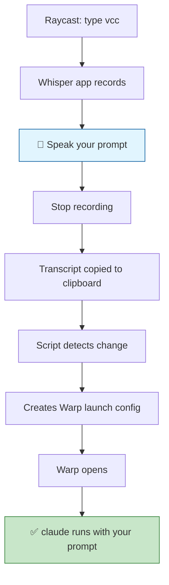
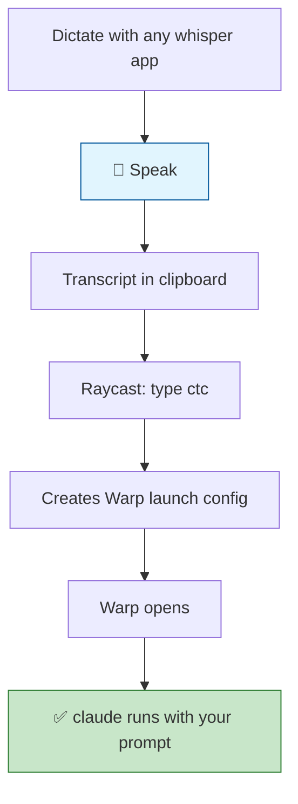
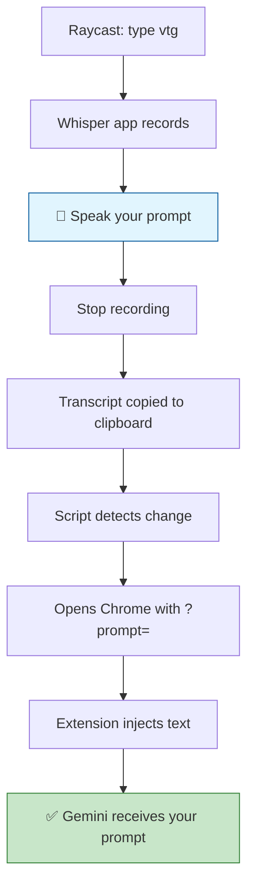
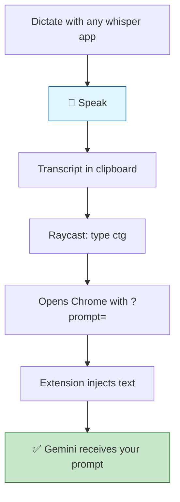
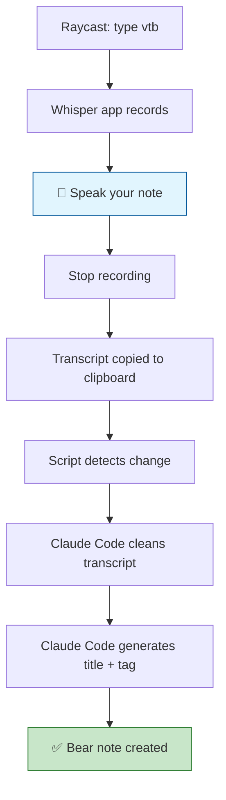
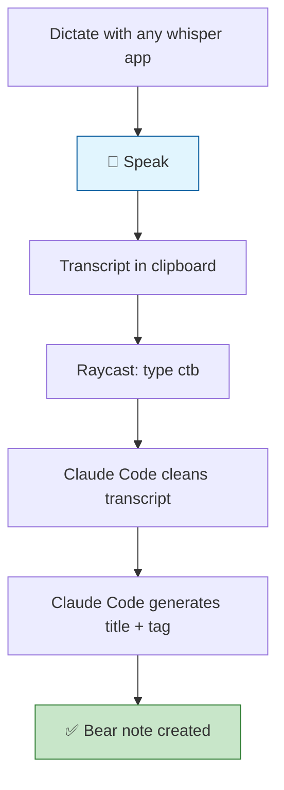

# Voice to AI - Raycast Scripts

Raycast script commands that integrate voice transcription with AI assistants (Claude Code, Google Gemini) and Bear notes. Supports **MacWhisper** and **Superwhisper** as recording apps.

## Flow Diagrams

### Claude: One-Shot (`vcc`)



### Claude: Two-Step (`ctc`)



### Gemini: One-Shot (`vtg`)



### Gemini: Two-Step (`ctg`)



### Bear: One-Shot (`vtb`)



### Bear: Two-Step (`ctb`)



## Scripts

### Voice to Claude (`vcc`)
One-shot voice-to-Claude workflow:
1. Triggers your configured whisper app
2. Records your voice and transcribes locally
3. Detects when transcription is copied to clipboard
4. Opens Warp terminal in `~/Developer`
5. Automatically runs `claude 'your transcription'`

### Clipboard to Claude (`ctc`)
Two-step workflow (more reliable):
1. Use any whisper app to dictate separately
2. Run this command to send clipboard content to Claude in Warp

### Voice to Gemini (`vtg`)
One-shot voice-to-Gemini workflow:
1. Triggers your configured whisper app
2. Records your voice and transcribes locally
3. Detects when transcription is copied to clipboard
4. Opens Chrome with URL-encoded prompt
5. Extension injects text into Gemini input

### Clipboard to Gemini (`ctg`)
Two-step workflow:
1. Use any whisper app to dictate separately
2. Run this command to open Gemini with clipboard content

### Voice to Bear (`vtb`)
One-shot voice-to-Bear note workflow:
1. Triggers your configured whisper app
2. Records and transcribes locally
3. Cleans transcript with Claude Code (grammar, filler words, markdown formatting)
4. Generates title and tags via Claude Code
5. Creates Bear note with cleaned text + `#voice-note` tag

### Clipboard to Bear (`ctb`)
Two-step workflow:
1. Use any whisper app to dictate separately
2. Run this command to clean and save to Bear

## Requirements

### Core
- **Raycast** - command launcher
- **One of the following whisper apps:**
  - **MacWhisper Pro** - for Global feature with auto-copy
  - **Superwhisper** - with clipboard output mode

### For Claude Scripts
- **Warp** - terminal with launch configuration support
- **Claude Code** - CLI tool (`claude`)

### For Gemini Scripts
- **Google Chrome** - browser
- **[Gemini URL Prompt](https://chromewebstore.google.com/detail/gemini-url-prompt/kdbgjkfdooaiompgeckjbegnnccchmma)** - Chrome extension

### For Bear Scripts
- **Bear** - note-taking app
- **Claude Code** - CLI tool (`claude`)

## Installation

### Raycast Scripts

1. Copy scripts to a folder (e.g., `~/Developer/raycast-scripts/`)
2. Make executable:
   ```bash
   chmod +x *.sh
   ```
3. Open Raycast → Settings → Extensions → Script Commands
4. Click "Add Directories" → select your scripts folder
5. In Raycast, run "Reload Script Directories"

### Chrome Extension (for Gemini)

1. Install [Gemini URL Prompt](https://chromewebstore.google.com/detail/gemini-url-prompt/kdbgjkfdooaiompgeckjbegnnccchmma) from the Chrome Web Store

## Whisper App Configuration

Each `voice-to-*.sh` script has a `WHISPER_APP` variable at the top. Set it to your app of choice:

```bash
# Whisper app: macwhisper or superwhisper
WHISPER_APP=macwhisper
```

### MacWhisper Setup

1. Open MacWhisper → Settings → Global
2. Set keyboard shortcut: `⌃⌥W` (Control+Option+W)
3. Enable **Auto Start** - begins recording immediately
4. Enable **Auto Copy** - copies transcript to clipboard when done

### Superwhisper Setup

1. Open Superwhisper → Settings
2. Disable **Restore Clipboard** - the scripts need the transcript to remain on the clipboard
3. Configure a transcription mode that copies output to the clipboard
4. The scripts trigger recording via the `superwhisper://record` URL scheme

### Wispr Flow

Wispr Flow types directly into the active text field and cannot be triggered programmatically. It does **not** work with the `voice-to-*` scripts. However, it works well with the **clipboard-to-*** scripts (`ctb`, `ctc`, `ctg`) — dictate with Wispr Flow, copy the text, then run the clipboard command.

## Usage

### Option A: One-Shot (Voice to Claude)
1. Open Raycast, type `vcc` → Enter
2. Your whisper app starts recording
3. Speak your prompt
4. Stop recording
5. Wait for transcription → Warp opens with Claude

### Option B: Two-Step (Clipboard to Claude)
1. Dictate with your whisper app → speak → stop
2. Open Raycast, type `ctc` → Enter
3. Warp opens with Claude using your transcript

### Option C: One-Shot (Voice to Gemini)
1. Open Raycast, type `vtg` → Enter
2. Your whisper app starts recording
3. Speak your prompt
4. Stop recording
5. Chrome opens Gemini with your prompt

### Option D: Two-Step (Clipboard to Gemini)
1. Dictate with your whisper app → speak → stop
2. Open Raycast, type `ctg` → Enter
3. Chrome opens Gemini with your transcript

## Customization

Edit the scripts to change:

```bash
# Whisper app: macwhisper or superwhisper
WHISPER_APP=macwhisper

# Working directory for Claude
DEVELOPER_PATH="/Users/gaiar/Developer"

# How long to wait for transcription (seconds) — set in whisper-lib.sh
WHISPER_TIMEOUT=600

# MacWhisper shortcut (must match your MacWhisper settings) — set in whisper-lib.sh
MACWHISPER_SHORTCUT='keystroke "w" using {control down, option down}'
```

## How It Works

### Claude Scripts
Uses Warp's launch configuration feature:
1. Create a temporary YAML config in `~/.warp/launch_configurations/`
2. Open Warp via `warp://launch/<config-name>` URL scheme
3. Warp executes the `claude` command with your transcript
4. Config file is cleaned up after 5 seconds

### Gemini Scripts
Uses URL parameters + Chrome extension:
1. URL-encode the transcript with Python's urllib
2. Open `https://gemini.google.com/app?prompt=<encoded-text>`
3. Chrome extension detects `?prompt=` parameter
4. Extension injects text into Gemini's input field

## Troubleshooting

**WHISPER_APP not set:**
- Each `voice-to-*.sh` script must have `WHISPER_APP` set to `macwhisper` or `superwhisper`
- The script will error with a list of supported values if unset or unrecognized

**MacWhisper Global doesn't open:**
- Check keyboard shortcut matches in both MacWhisper and script
- Ensure Raycast has Accessibility permission

**Superwhisper doesn't start recording:**
- Make sure Superwhisper is running
- Verify the `superwhisper://record` URL scheme works (run `open "superwhisper://record"` in Terminal)

**Warp opens but no command runs:**
- Verify `~/.warp/launch_configurations/` directory exists
- Check Warp version supports launch configurations

**Timeout waiting for transcription:**
- Increase `WHISPER_TIMEOUT` value in `whisper-lib.sh`
- For MacWhisper: ensure "Auto Copy" is enabled
- For Superwhisper: ensure "Restore Clipboard" is disabled

**Gemini opens but input is empty:**
- Install [Gemini URL Prompt](https://chromewebstore.google.com/detail/gemini-url-prompt/kdbgjkfdooaiompgeckjbegnnccchmma) from the Chrome Web Store
- Check extension is enabled on gemini.google.com
- Try refreshing the page

## License

MIT
