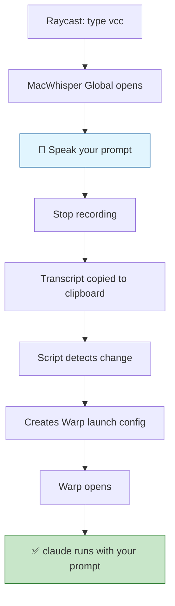
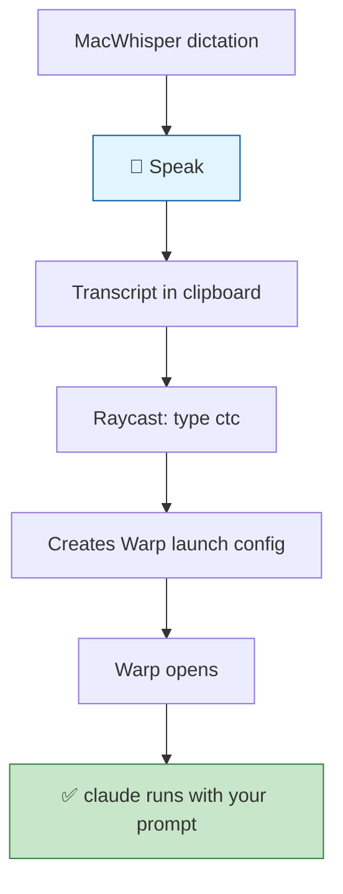
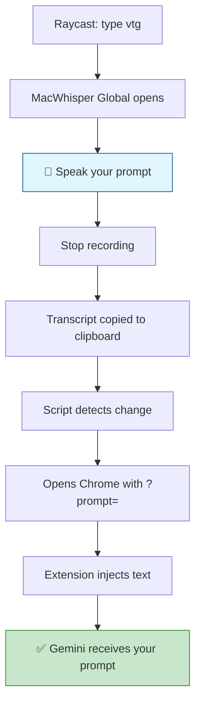
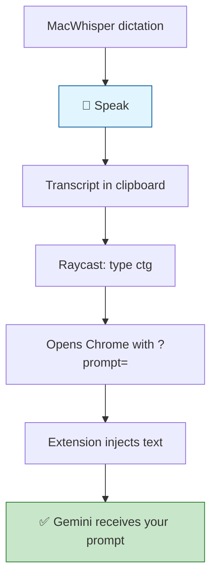
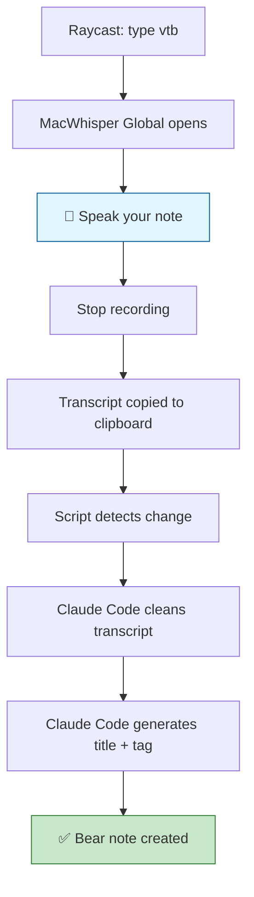
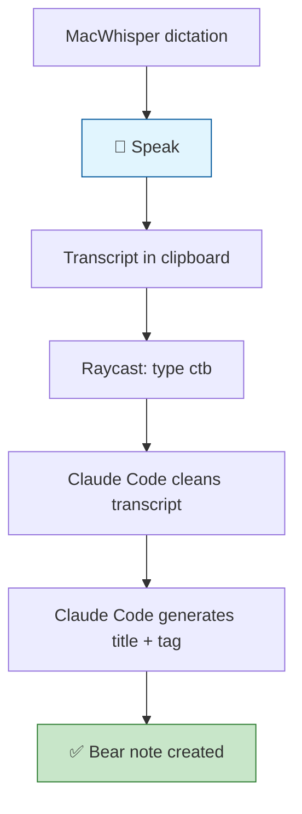

# Voice to AI - Raycast Scripts

Raycast script commands that integrate MacWhisper voice transcription with AI assistants (Claude Code, Google Gemini).

## Flow Diagrams

### Claude: One-Shot (`vcc`)



### Claude: Two-Step (`ctc`)



### Gemini: One-Shot (`vtg`)



### Gemini: Two-Step (`ctg`)



### Bear: One-Shot (`vtb`)



### Bear: Two-Step (`ctb`)



## Scripts

### Voice to Claude (`vcc`)
One-shot voice-to-Claude workflow:
1. Triggers MacWhisper Global overlay
2. Records your voice and transcribes locally
3. Detects when transcription is copied to clipboard
4. Opens Warp terminal in `~/Developer`
5. Automatically runs `claude 'your transcription'`

### Clipboard to Claude (`ctc`)
Two-step workflow (more reliable):
1. Use MacWhisper dictation separately (fn key or custom shortcut)
2. Run this command to send clipboard content to Claude in Warp

### Voice to Gemini (`vtg`)
One-shot voice-to-Gemini workflow:
1. Triggers MacWhisper Global overlay
2. Records your voice and transcribes locally
3. Detects when transcription is copied to clipboard
4. Opens Chrome with URL-encoded prompt
5. Extension injects text into Gemini input

### Clipboard to Gemini (`ctg`)
Two-step workflow:
1. Use MacWhisper dictation separately
2. Run this command to open Gemini with clipboard content

### Voice to Bear (`vtb`)
One-shot voice-to-Bear note workflow:
1. Triggers MacWhisper Global overlay
2. Records and transcribes locally
3. Cleans transcript with Claude Code (grammar, filler words, markdown formatting)
4. Generates title and tags via Claude Code
5. Creates Bear note with cleaned text + `#voice-note` tag

### Clipboard to Bear (`ctb`)
Two-step workflow:
1. Use MacWhisper dictation separately
2. Run this command to clean and save to Bear

## Requirements

### Core
- **MacWhisper Pro** - for Global feature with auto-copy
- **Raycast** - command launcher

### For Claude Scripts
- **Warp** - terminal with launch configuration support
- **Claude Code** - CLI tool (`claude`)

### For Gemini Scripts
- **Google Chrome** - browser
- **[Gemini URL Prompt](https://chromewebstore.google.com/detail/gemini-url-prompt/kdbgjkfdooaiompgeckjbegnnccchmma)** - Chrome extension

### For Bear Scripts
- **Bear** - note-taking app
- **Claude Code** - CLI tool (`claude`)

## Installation

### Raycast Scripts

1. Copy scripts to a folder (e.g., `~/Developer/raycast-scripts/`)
2. Make executable:
   ```bash
   chmod +x *.sh
   ```
3. Open Raycast → Settings → Extensions → Script Commands
4. Click "Add Directories" → select your scripts folder
5. In Raycast, run "Reload Script Directories"

### Chrome Extension (for Gemini)

1. Install [Gemini URL Prompt](https://chromewebstore.google.com/detail/gemini-url-prompt/kdbgjkfdooaiompgeckjbegnnccchmma) from the Chrome Web Store

## MacWhisper Configuration

1. Open MacWhisper → Settings → Global
2. Set keyboard shortcut: `⌃⌥W` (Control+Option+W)
3. Enable **Auto Start** - begins recording immediately
4. Enable **Auto Copy** - copies transcript to clipboard when done

## Usage

### Option A: One-Shot (Voice to Claude)
1. Open Raycast, type `vcc` → Enter
2. MacWhisper Global appears, starts recording
3. Speak your prompt
4. Press `⌃⌥W` to stop recording
5. Wait for transcription → Warp opens with Claude

### Option B: Two-Step (Clipboard to Claude)
1. Use MacWhisper dictation (fn key) → speak → release
2. Open Raycast, type `ctc` → Enter
3. Warp opens with Claude using your transcript

### Option C: One-Shot (Voice to Gemini)
1. Open Raycast, type `vtg` → Enter
2. MacWhisper Global appears, starts recording
3. Speak your prompt
4. Press `⌃⌥W` to stop recording
5. Chrome opens Gemini with your prompt

### Option D: Two-Step (Clipboard to Gemini)
1. Use MacWhisper dictation (fn key) → speak → release
2. Open Raycast, type `ctg` → Enter
3. Chrome opens Gemini with your transcript

## Customization

Edit the scripts to change:

```bash
# MacWhisper shortcut (must match your MacWhisper settings)
MACWHISPER_SHORTCUT='keystroke "w" using {control down, option down}'

# Working directory for Claude
DEVELOPER_PATH="/Users/gaiar/Developer"

# How long to wait for transcription (seconds)
TIMEOUT=600
```

## How It Works

### Claude Scripts
Uses Warp's launch configuration feature:
1. Create a temporary YAML config in `~/.warp/launch_configurations/`
2. Open Warp via `warp://launch/<config-name>` URL scheme
3. Warp executes the `claude` command with your transcript
4. Config file is cleaned up after 5 seconds

### Gemini Scripts
Uses URL parameters + Chrome extension:
1. URL-encode the transcript with Python's urllib
2. Open `https://gemini.google.com/app?prompt=<encoded-text>`
3. Chrome extension detects `?prompt=` parameter
4. Extension injects text into Gemini's input field

## Troubleshooting

**MacWhisper Global doesn't open:**
- Check keyboard shortcut matches in both MacWhisper and script
- Ensure Raycast has Accessibility permission

**Warp opens but no command runs:**
- Verify `~/.warp/launch_configurations/` directory exists
- Check Warp version supports launch configurations

**Timeout waiting for transcription:**
- Increase `TIMEOUT` value in the script
- Ensure MacWhisper "Auto Copy" is enabled

**Gemini opens but input is empty:**
- Install [Gemini URL Prompt](https://chromewebstore.google.com/detail/gemini-url-prompt/kdbgjkfdooaiompgeckjbegnnccchmma) from the Chrome Web Store
- Check extension is enabled on gemini.google.com
- Try refreshing the page

## License

MIT
